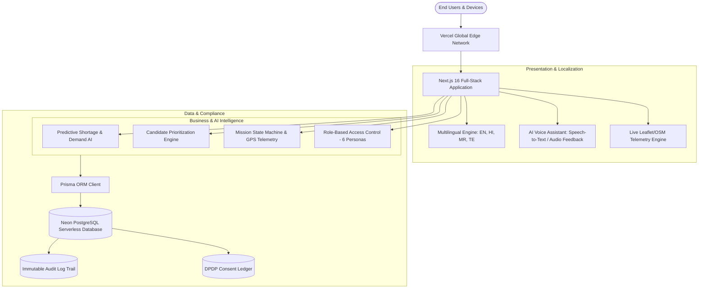

# 🇮🇳 YUVA-RAKT AI — Master Presentation Slide Deck

---

## 📽️ SLIDE 1: Title & Vision

### **YUVA-RAKT AI**
#### **National Youth Blood Intelligence & Emergency Response Network**
*“Predict the Need. Mobilize the Youth. Save Lives.”*

- **Live URL:** [https://yuvaraktai.vercel.app](https://yuvaraktai.vercel.app)
- **GitHub:** [https://github.com/SYEDABRAR037/YUVA-RAKT-AI](https://github.com/SYEDABRAR037/YUVA-RAKT-AI)
- **Tech Stack:** Next.js 16 (App Router), TypeScript, PostgreSQL (Neon Cloud), Prisma ORM, Leaflet/OSM, TailwindCSS

---

## 📽️ SLIDE 2: The Problem — India’s Critical Blood Bottlenecks

1. **Panic-Driven & Reactive**: Emergency blood requests happen *after* trauma or acute surgical hemorrhage occurs, causing frantic social media searches and losing the golden hour.
2. **Siloed & Opaque Inventories**: 3,800+ blood banks across India operate without interoperable real-time stock visibility.
3. **Underutilized Youth Demographic**: India has 350+ million youth, but lacks a verified, frictionless, privacy-safe mobilization platform.
4. **The Critical Transit Blindspot**: Once blood units are allocated, there is zero live GPS tracking between blood centres and ICU casualty wards.

---

## 📽️ SLIDE 3: The Solution — End-to-End Coordination Model

```
       1. PREDICT                   2. MOBILIZE                   3. DELIVER
┌────────────────────────┐   ┌────────────────────────┐   ┌────────────────────────┐
│  AI Multi-Horizon      │   │  Verified Youth Pool   │   │  Stage-Aware Live GPS  │
│  Demand Forecasting    │──▶│  Autonomous Consent-   │──▶│  Emergency Ambulance   │
│  (7d, 14d, 30d models) │   │  Verified Mobilization │   │  Transit Telemetry     │
└────────────────────────┘   └────────────────────────┘   └────────────────────────┘
```

> **Core Philosophy:** *We don't wait for shortages to happen. We predict the deficit, mobilize verified youth beforehand, and deliver blood in real-time.*

---

## 📽️ SLIDE 4: Full System Architecture & Tech Stack



---

## 📽️ SLIDE 5: Pillar 1 — Predictive AI Demand Engine

- **Statistical Multi-Horizon Modeling**:
  - **7-Day Operational**: Immediate hospital trauma & surgery demand.
  - **14-Day Tactical**: Emerging regional seasonal trends (e.g., dengue platelet surges).
  - **30-Day Strategic**: District-wide buffer inventory planning.
- **Granular 8×4 Matrix**: Forecasts for all **8 Blood Groups** (`O+`, `O-`, `A+`, `A-`, `B+`, `B-`, `AB+`, `AB-`) across **4 Components** (Whole Blood, RBC, Platelets, Plasma).
- **Explainable AI (XAI)**: Provides human-readable clinical reasoning and confidence scores for health officials.

---

## 📽️ SLIDE 6: Pillar 2 — Autonomous Youth Mobilization

- **Smart Candidate Prioritization**:
  - Filters by geographic proximity, blood group compatibility, verified eligibility, and voluntary availability.
- **India DPDP Act (2023) Privacy Architecture**:
  - Granular, revocable donor consent toggles.
  - Digital donor profiles with voluntary emergency alert channels.
  - Zero unsolicited spam; automated notifications only for verified clinical matches.

---

## 📽️ SLIDE 7: Pillar 3 — Zomato/Uber-Style Live Ambulance Telemetry

- **Dynamic Route Adaptation**: Automatically flips waypoint destination from **Blood Centre Pickup** to **Hospital Casualty** once units are collected.
- **Live GPS Streaming**: Real-time breadcrumb history, speed, distance remaining (km), and ETA (minutes).

---

## 📽️ SLIDE 8: Inclusivity — 4-Language Regional UI & AI Voice Assistant

- **Supported Languages**:
  - 🇬🇧 **English (`EN`)**
  - 🇮🇳 **Hindi (`HI` — हिन्दी)**: *राष्ट्रीय युवा रक्त बुद्धिमत्ता एवं आपातकालीन प्रतिक्रिया नेटवर्क*
  - 🇮🇳 **Marathi (`MR` — मराठी)**: *राष्ट्रीय युवा रक्त गुप्तचर आणि आपत्कालीन प्रतिसाद नेटवर्क*
  - 🇮🇳 **Telugu (`TE` — తెలుగు)**: *జాతీయ యువత రక్త నిఘా & అత్యవసర స్పందన నెట్‌వర్క్*
- **Multilingual AI Voice Assistant**:
  - Voice recognition and speech feedback in native Indian accents (`en-IN`, `hi-IN`, `mr-IN`, `te-IN`).
  - Hands-free navigation to Emergency Radar, Live Map, Demand Forecast, and Inventory.

---

## 📽️ SLIDE 9: Role-Based Access Control (6 Personas)

| Operational Role | Key Capabilities | Demo Login |
|---|---|---|
| 👑 **Super Admin** | Platform-wide audit logs, organization verification, user management | `admin@yuvarakt.demo` / `Admin@12345` |
| 🏛️ **Government Official** | National Command Center, AI Demand Forecast, Live Geospatial Map | `government@yuvarakt.demo` / `Govt@12345` |
| 🏥 **Hospital Staff** | Emergency & Routine Requisition management, ambulance tracking | `hospital@yuvarakt.demo` / `Hospital@12345` |
| 🩸 **Blood Bank Centre** | 8×4 Inventory ledger, batch allocations, donor verification | `bloodbank@yuvarakt.demo` / `BloodBank@12345` |
| 🧑 **Youth Donor** | Digital donor card, donation history, availability toggle | `donor@yuvarakt.demo` / `Donor@12345` |
| 🚑 **Ambulance Operator** | Mission terminal, real-time GPS telemetry broadcast, route progression | `ambulance@yuvarakt.demo` / `Ambulance@12345` |

---

## 📽️ SLIDE 10: Security, Compliance & Testing Rigor

- **Zero-Credential Audit Logging**: Sensitive information (passwords, tokens, hashes) is strictly sanitized from audit trails.
- **100% Test Pass Rate**: Verified through 7 automated end-to-end acceptance test suites (**192 / 192 tests passed**).
- **Production Serverless Architecture**: Hosted on Vercel Edge Network with Neon PostgreSQL for zero-latency, auto-scaling performance.

---

## 📽️ SLIDE 11: Live Demo Walkthrough (What to Click)

1. **Home Screen**: Open `https://yuvaraktai.vercel.app` ➔ Toggle language to **Hindi/Marathi/Telugu** ➔ Click the **Mic** button to trigger the Voice Assistant.
2. **National Command Center**: Login as `admin@yuvarakt.demo` ➔ Show **AI Demand Forecast** with 7d/14d/30d horizons ➔ Open **Live Map** to see regional heatmaps.
3. **Emergency Workflow**: Show active emergency requisition ➔ Demonstrate autonomous discovery finding the nearest blood bank in Pune.
4. **Live Ambulance Tracker**: Open live ambulance tracking page ➔ Show real-time GPS telemetry, speed, distance remaining, and live waypoint transition.

---

## 📽️ SLIDE 12: Key Advantages over Existing Systems

| Feature | Traditional Systems (e-RaktKosh / WhatsApp / Calls) | 🇮🇳 **YUVA-RAKT AI** |
|---|---|---|
| **Approach** | ❌ **100% Reactive**: Panic starts only *after* emergency occurs | ✅ **Proactive & Predictive**: AI forecasts shortages 7–30 days in advance |
| **Inventory Visibility** | ❌ **Static/Delayed**: Manual daily uploads, frequently stale | ✅ **Real-Time 8×4 Matrix**: Instant live inventory & batch allocation |
| **Donor Mobilization** | ❌ **Spam/Broadcast**: Mass WhatsApp forwards causing donor fatigue | ✅ **Smart Prioritization**: Geo-targeted, consent-verified youth mobilization |
| **Emergency Transport** | ❌ **Blind Spot**: Zero visibility on blood units during transit | ✅ **Live Telemetry**: Real-time GPS ambulance tracking (Pickup ➔ Delivery) |
| **Language Inclusivity** | ❌ **English Only**: Difficult for rural/tier-2 youth & drivers | ✅ **4 Languages + Voice AI**: English, Hindi, Marathi, Telugu + Voice |
| **Privacy Compliance** | ❌ **Unregulated Contact Sharing**: Phone numbers exposed publicly | ✅ **DPDP Act (2023) Compliant**: Granular, revocable consent ledger |

---

## 📽️ SLIDE 13: What Makes YUVA-RAKT AI Truly Innovative?

1. 🧠 **Multi-Horizon AI Forecasting Engine**:
   - Instead of basic historical averages, our statistical model analyzes clinical seasonality, local disease surges (e.g. dengue platelet spikes), and trauma risk indices to generate **7-day operational, 14-day tactical, and 30-day strategic deficit warnings** with Explainable AI (XAI) reasoning.

2. 🚑 **Stage-Aware Emergency Transport State Engine**:
   - The first platform in India to bring **Uber/Zomato-grade live telemetry** to blood transit. The routing engine automatically navigates the ambulance to the nearest compatible blood centre for pickup, then dynamically shifts waypoints to the hospital emergency ICU casualty upon collection.

3. 🎙️ **Multilingual Emergency Voice AI**:
   - First responders and hospital staff in high-stress situations can speak commands in **Hindi, Marathi, Telugu, or English** to instantly pull up live maps, radar alerts, or inventory statuses without typing.

4. 🔒 **DPDP-Compliant Autonomous Mobilization**:
   - Uses an algorithmic multi-factor ranking formula (Proximity + Compatibility + Availability + Past Donation Intervals) that respects donor privacy and statutory rest periods.

---

## 📽️ SLIDE 14: Is it Really Useful? (Real-World Life-Saving Impact)

### 🏥 The Ground Reality in India:
- India faces an annual deficit of **over 1 million blood units**.
- **Golden Hour Deaths**: 60% of preventable trauma and postpartum hemorrhage deaths occur due to delayed blood delivery.

### 🌟 How YUVA-RAKT AI Solves This in Real Life:

1. ⏱️ **Reduces Emergency Response Time by up to 65%**:
   - By eliminating manual phone calls, WhatsApp searching, and lost transit time, critical emergency blood reaches patients inside the clinical golden hour.

2. 🩸 **Prevents Blood Expiration & Wastage**:
   - Platelets expire in just **5 days**. Our AI forecasts ensure blood centres only collect what will be needed, virtually eliminating platelet wastage.

3. 🇮🇳 **Bridges the Urban-Rural Supply Gap**:
   - Enables Tier-2/Tier-3 district hospitals to autonomously identify and dispatch surplus blood units from nearby regional blood banks.

4. 🤝 **Empowers 350 Million Youth**:
   - Turns India's massive youth demographic into a verified, reliable, standing national blood donor reserve.

---

## 📽️ SLIDE 15: Summary & Conclusion

> **YUVA-RAKT AI transforms India’s blood response from a panic-driven, fragmented search into a proactive, AI-predicted, and live-tracked national life-saving network.**

**Thank You! We are open for Questions.**
- 🌐 **Live URL:** [https://yuvaraktai.vercel.app](https://yuvaraktai.vercel.app)
- 💻 **GitHub:** [https://github.com/SYEDABRAR037/YUVA-RAKT-AI](https://github.com/SYEDABRAR037/YUVA-RAKT-AI)
